# Performance Benchmarks

This document plots the results of a series of performance benchmarks in order to compare the performance of `graphy` against other libraries as well as against itself (using different modes/options). The benchmarks demonstrate a few select task objectives designed to simulate real-world scenarios.

Want to see how other libraries stack up? Feel free to [open an issue](https://github.com/blake-regalia/graphy.js/issues).

## Interpretting the Charts
 - Each data point in the following charts represents the mean value of 5 trials.
 - The **X-axis units** for all charts are in **Millions of Quads**, and correspond to the number of triples/quads fed into the process via stdin
 - The **Y-axis for each 'Velocity' chart** denotes the number of **Quads per millisecond (Quads/ms)** at which the task objective completed.

## Disclaimers
 - Memory-intensive tasks were run with the `--max-old-space-size=8192` node.js option (e.g., the [distinct task](#distinct-task)). Some charts show a non-linear progression in time due to the fact that V8's GC starts aggressively trying to free up memory.
 - Memory usage represents the resident stack size (RSS) at the moment the results are reported. For `graphy/scan` modes, memory usage stats are not yet available.
 - All Turtle input files are using prefixed names for identifiers when possible.

There are multiple modes for `graphy`:
  - the default mode, which means that validation is enabled for reading
  - ['relaxed' mode](https://graphy.link/content.textual#config_read-no-input), which skips validation for faster reading
  - ['scan' mode](https://graphy.link/content.textual#verb_scan), which uses multiple threads (2, 4, 8 or 16 in these trials) to read the input stream

## Competitors
 - [N3.js](https://github.com/rdfjs/N3.js) v1.3.6
 - [graphy](https://github.com/blake-regalia/graphy.js) v4.2.0

## Task Objectives
 - [Count Task](#count-task) -- Count the number of statements in an RDF document.
 - [Distinct Task](#distinct-task) -- Count the distinct number of triples/quads in an RDF document.
 - [Convert Task](#convert-task) -- Convert an RDF document from one serialization format to another.

⬇️&nbsp;&nbsp;&nbsp;&nbsp;⬇️&nbsp;&nbsp;&nbsp;&nbsp;⬇️

------------

## Count Task
Count the number of statements in an RDF document.

**Test Flavors:**
 - With [N-Triples as input](#test_count_nt)
 - With [Turtle as input](#test_count_ttl)

<a name="#test_count_nt" />

### Count Task With N-Triples as input

Input File: Wikidata Data Dump

Velocity (Quads/ms)  ▲=👍 | Memory Usage (MiB)  ▼=👍
:---:|:---:
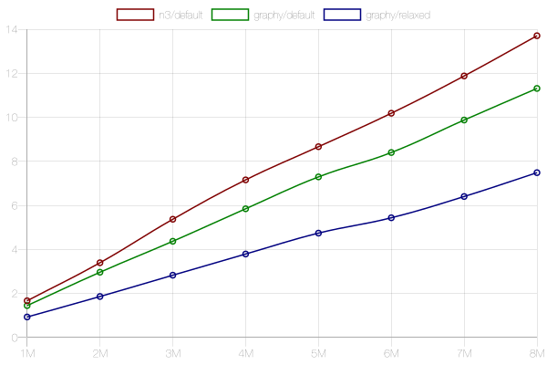 | 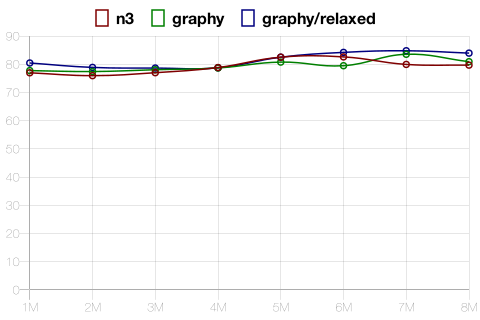

Input File: DBpedia "Person Data" Dump

Velocity (Quads/ms)  ▲=👍 | Memory Usage (MiB)  ▼=👍
:---:|:---:
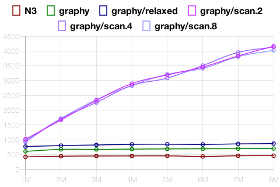 | 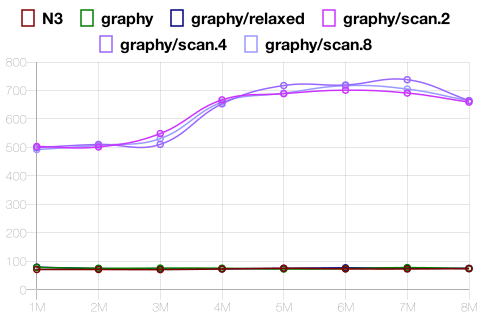

<a name="#test_count_ttl" />

### Count Task With Turtle as input

Input File: Wikidata Data Dump

Velocity (Quads/ms)  ▲=👍 | Memory Usage (MiB)  ▼=👍
:---:|:---:
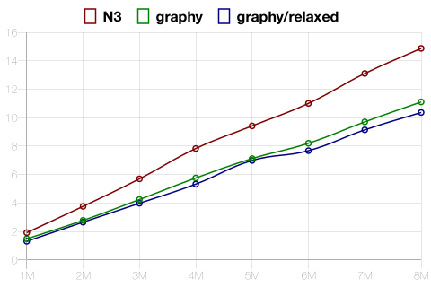 | 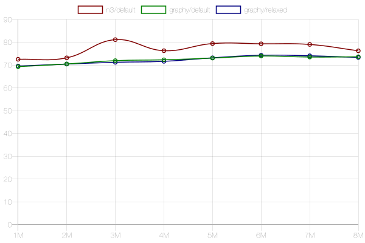

Input File: DBpedia "Person Data" Dump

Velocity (Quads/ms)  ▲=👍 | Memory Usage (MiB)  ▼=👍
:---:|:---:
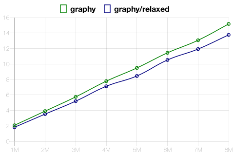 | 

------------

## Distinct Task
Count the distinct number of triples/quads in an RDF document.

**Test Flavors:**
 - With [N-Triples as input](#test_distinct_nt)
 - With [Turtle as input](#test_distinct_ttl)

<a name="#test_distinct_nt" />

### Distinct Task With N-Triples as input

Input File: Wikidata Data Dump

Velocity (Quads/ms)  ▲=👍 | Memory Usage (MiB)  ▼=👍
:---:|:---:
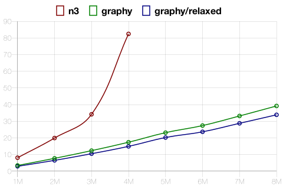 | 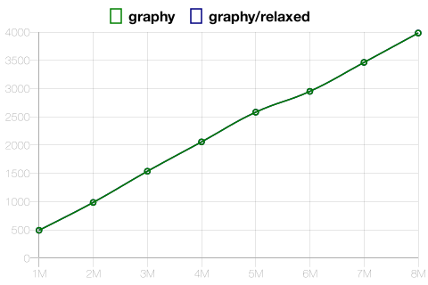

Input File: DBpedia "Person Data" Dump

Velocity (Quads/ms)  ▲=👍 | Memory Usage (MiB)  ▼=👍
:---:|:---:
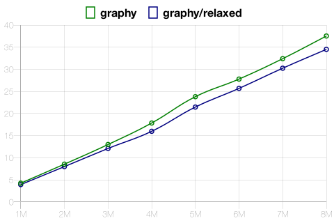 | 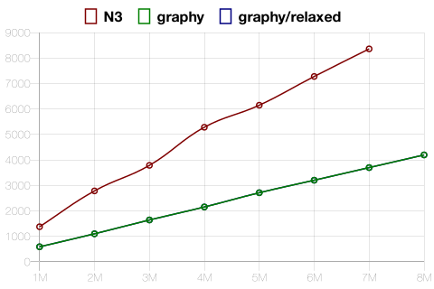

<a name="#test_distinct_ttl" />

### Distinct Task With Turtle as input

Input File: Wikidata Data Dump

Velocity (Quads/ms)  ▲=👍 | Memory Usage (MiB)  ▼=👍
:---:|:---:
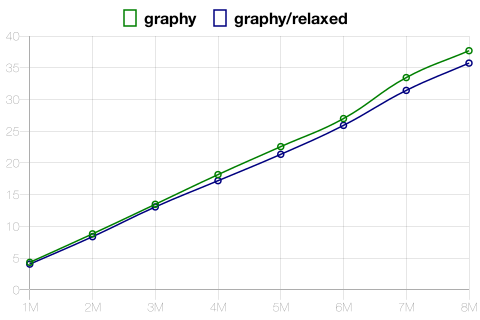 | 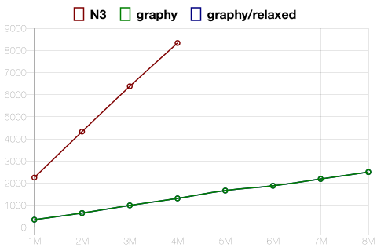

Input File: DBpedia "Person Data" Dump

Velocity (Quads/ms)  ▲=👍 | Memory Usage (MiB)  ▼=👍
:---:|:---:
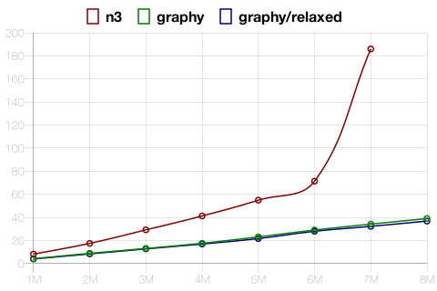 | 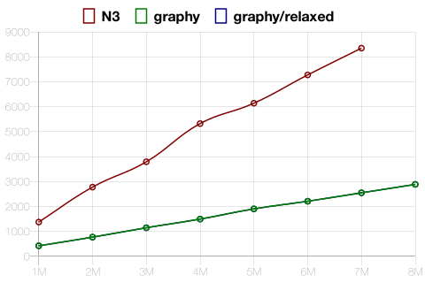

------------

## Convert Task
Convert an RDF document from one serialization format to another.

**Test Flavors:**
 - With [N-Triples as input => Turtle as output](#test_convert_nt-ttl)
 - With [Turtle as input => N-Triples as output](#test_convert_ttl-nt)

<a name="#test_convert_nt-ttl" />

### Convert Task With N-Triples as input => Turtle as output

Input File: Wikidata Data Dump

Velocity (Quads/ms)  ▲=👍 | Memory Usage (MiB)  ▼=👍
:---:|:---:
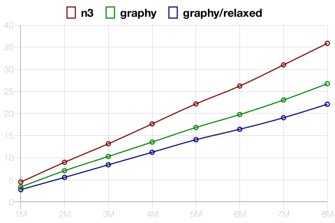 | 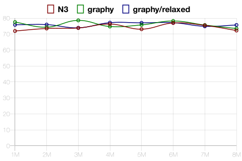

Input File: DBpedia "Person Data" Dump

Velocity (Quads/ms)  ▲=👍 | Memory Usage (MiB)  ▼=👍
:---:|:---:
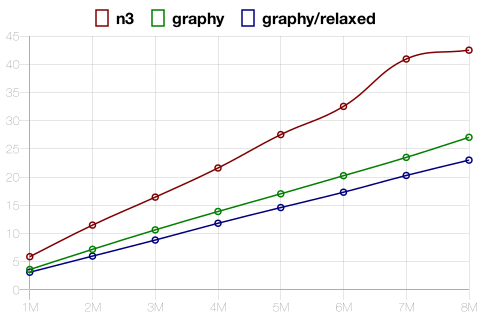 | 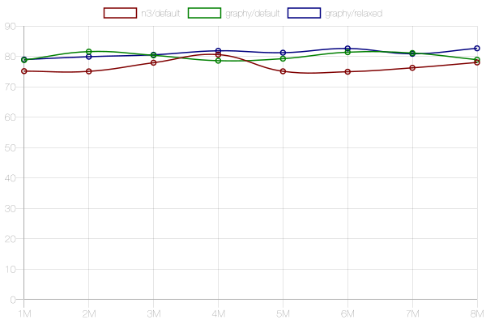

<a name="#test_convert_ttl-nt" />

### Convert Task With Turtle as input => N-Triples as output

Input File: Wikidata Data Dump

Velocity (Quads/ms)  ▲=👍 | Memory Usage (MiB)  ▼=👍
:---:|:---:
 | 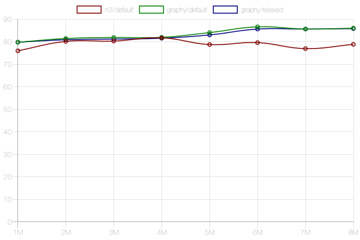

Input File: DBpedia "Person Data" Dump

Velocity (Quads/ms)  ▲=👍 | Memory Usage (MiB)  ▼=👍
:---:|:---:
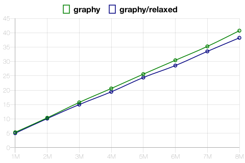 | 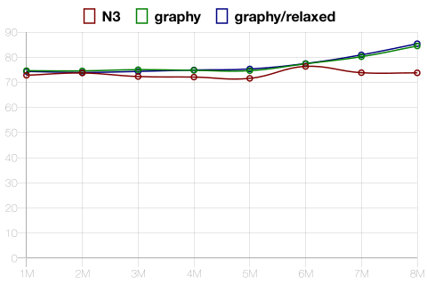

